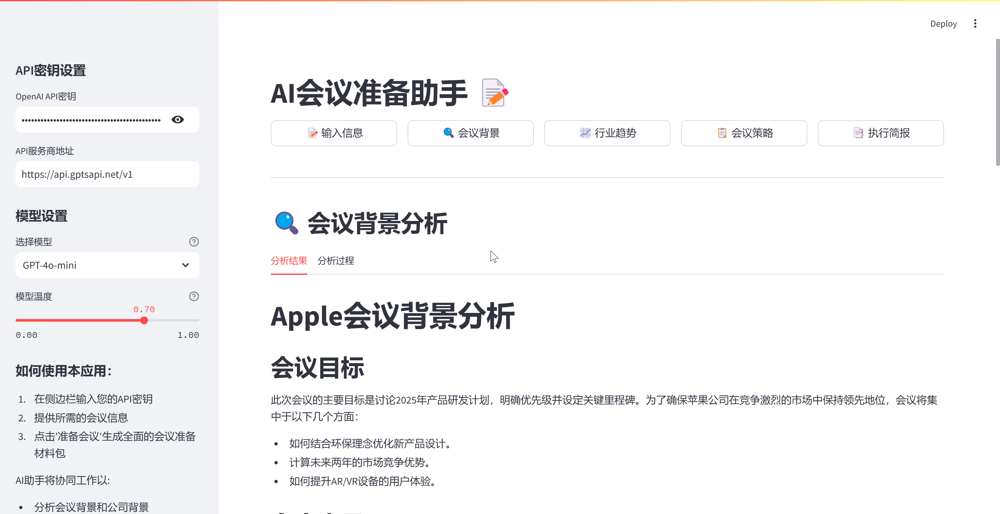

# 📝 会议准备AI助手 [![Open in Streamlit][share_badge]][share_link]

[share_badge]: https://static.streamlit.io/badges/streamlit_badge_black_white.svg
[share_link]: https://9yskzputwjappacugobfxwo.streamlit.app/

这是一个基于Streamlit开发的会议准备AI助手应用。它利用OpenAI的GPT模型和维基百科搜索功能，通过多个AI助手协同工作，为您生成全面的会议准备材料。

🔗 [在线演示](https://9yskzputwjappacugobfxwo.streamlit.app/) | [GitHub仓库](https://github.com/ROOKIE-AI/ai_meeting_agent)

## 📺 界面预览



## 🔄 工作流程

```mermaid
graph TD
    A[用户输入] --> B[信息预处理]
    B --> C{AI助手团队}
    
    C --> D[背景分析专家]
    C --> E[行业专家]
    C --> F[策略专家]
    C --> G[沟通专家]
    
    D --> |公司信息分析| H[背景报告]
    E --> |行业趋势分析| I[趋势报告]
    F --> |策略制定| J[会议策略]
    G --> |信息整合| K[执行简报]
    
    H --> L[最终输出]
    I --> L
    J --> L
    K --> L
    end
```

### 核心工作流程说明：

1. **输入阶段**
   - 收集会议基本信息
   - 验证API配置
   - 初始化系统状态

2. **AI助手协同**
   - 背景分析专家：深入研究公司信息
   - 行业专家：分析市场趋势
   - 策略专家：制定会议策略
   - 沟通专家：整合信息输出

3. **实时反馈**
   - 进度实时展示
   - 分析过程记录
   - 状态动态更新

4. **结果输出**
   - 多维度分析报告
   - 可操作性建议
   - 完整会议策略

### 🎯 界面特点

1. **简洁的导航栏设计**
   - 📝 输入信息
   - 🔍 会议背景
   - 📈 行业趋势
   - 📋 会议策略
   - 📑 执行简报

2. **智能配置面板**
   - API密钥设置
   - 模型选择
   - 参数调节

3. **实时分析展示**
   - 分析结果和过程双视图
   - 实时进度反馈
   - 详细日志记录

4. **人性化交互**
   - 清晰的表单布局
   - 即时的状态提示
   - 便捷的导航切换

## 🌟 主要功能

- **多AI助手协同系统**：
  - 会议背景分析专家
  - 行业趋势分析专家
  - 会议策略专家
  - 沟通简报专家

- **智能分析能力**：
  - 公司背景深度分析
  - 行业趋势洞察
  - 定制化会议策略
  - 详细执行简报

- **实时进度展示**：
  - 分析过程实时反馈
  - 进度条显示
  - 详细日志记录

## 🛠️ 技术特点

- **API集成**：
  - OpenAI GPT模型支持
  - 中文维基百科集成
  - DuckDuckGo搜索功能

- **模型配置**：
  - 多种模型可选
  - 温度参数调节
  - 自定义API地址

- **数据处理**：
  - 实时分析日志
  - 会话状态管理
  - 错误智能处理

## 🚀 如何开始使用

1. 克隆项目代码：
```bash
git clone https://github.com/ROOKIE-AI/ai_meeting_agent.git
cd ai_meeting_agent
```

2. 安装依赖：
```bash
pip install -r requirements.txt
```

3. 获取OpenAI API密钥：
- 注册 [OpenAI账号](https://platform.openai.com/)
- 获取API密钥

4. 运行应用：
```bash
streamlit run app.py
```

## 💡 使用说明

1. **基础设置**：
   - 在侧边栏输入OpenAI API密钥
   - 选择合适的AI模型
   - 根据需要调整模型参数

2. **信息输入**：
   - 填写公司名称
   - 设定会议目标
   - 添加参会人员信息
   - 指定会议时长
   - 列出重点关注领域

3. **启动分析**：
   - 点击"准备会议"按钮
   - 等待AI助手团队分析
   - 查看实时进度

4. **查看结果**：
   - 浏览会议背景分析
   - 研究行业趋势分析
   - 审阅会议策略和议程
   - 下载执行简报

## 📋 输出内容

- **会议背景分析**：
  - 公司概况
  - 最新发展
  - 核心业务
  - 竞争态势

- **行业分析**：
  - 市场趋势
  - 竞争格局
  - 机遇挑战
  - 发展方向

- **会议策略**：
  - 详细议程
  - 讨论要点
  - 时间安排
  - 参与者分工

- **执行简报**：
  - 关键信息总结
  - 行动建议
  - 跟进计划
  - 风险防控

## 🔒 隐私说明

- 所有分析均在线完成，不保存任何企业敏感信息
- API密钥安全存储，仅用于当前会话
- 分析结果临时保存，会话结束自动清除

## 🤝 贡献指南

欢迎提交Issue和Pull Request来帮助改进这个项目！

## 📬 联系方式

如有问题或建议，欢迎通过以下方式联系：
- 提交 GitHub Issue
- 发送邮件至 [RookieEmail@163.com]

## 📄 许可证

本项目采用 MIT 许可证