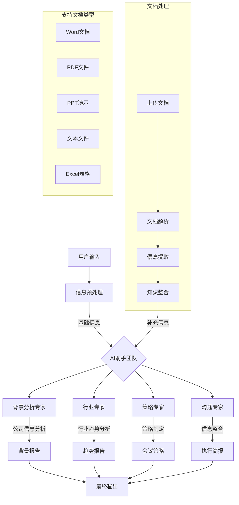
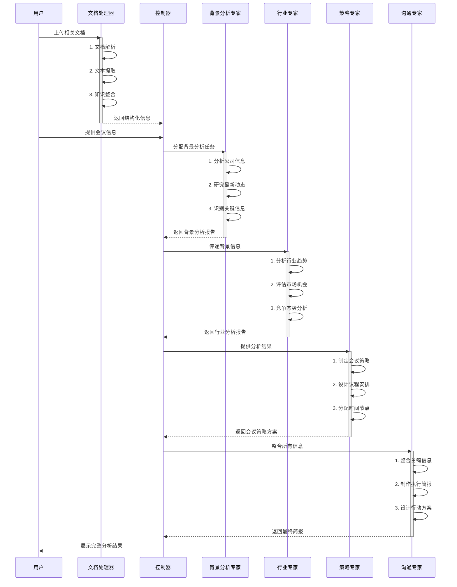
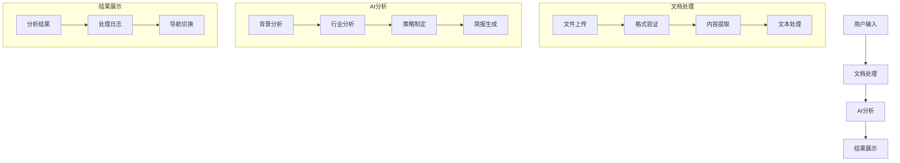

# 📝 会议准备AI助手 [![Open in Streamlit][share_badge]][share_link]

[share_badge]: https://static.streamlit.io/badges/streamlit_badge_black_white.svg
[share_link]: https://9yskzputwjappacugobfxwo.streamlit.app/

这是一个基于Streamlit开发的会议准备AI助手应用。它利用OpenAI的GPT模型和维基百科搜索功能，通过多个AI助手协同工作，为您生成全面的会议准备材料。

🔗 [在线演示](https://9yskzputwjappacugobfxwo.streamlit.app/) | [GitHub仓库](https://github.com/ROOKIE-AI/ai_meeting_agent)

## 📺 界面预览


## 🔄 工作流程

### 系统工作流程



### 智能体决策流程



### 支持的文档类型

1. **文本文档**
   - Word文档 (.doc, .docx)
   - PDF文件 (.pdf)
   - 文本文件 (.txt)
   - Markdown文件 (.md)

2. **数据文件**
   - Excel表格 (.xls, .xlsx)
   - CSV文件 (.csv)
   - JSON文件 (.json)

3. **演示文稿**
   - PowerPoint (.ppt, .pptx)
   - Keynote (.key)

4. **其他格式**
   - 网页链接 (URL)
   - 图片文件 (.jpg, .png)
   - 压缩文件 (.zip, .rar)

### 文档处理流程

1. **文档上传**
   - 支持批量上传
   - 文件格式验证
   - 大小限制检查

2. **内容提取**
   - 文本识别与提取
   - 表格数据解析
   - 图片信息提取

3. **信息整合**
   - 关键信息提取
   - 知识点归类
   - 上下文关联

4. **智能分析**
   - 文本语义分析
   - 数据趋势分析
   - 关键信息突出

### 核心工作流程说明：

1. **输入阶段**
   - 收集会议基本信息
   - 验证API配置
   - 初始化系统状态

2. **AI助手协同**
   - 背景分析专家：深入研究公司信息
   - 行业专家：分析市场趋势
   - 策略专家：制定会议策略
   - 沟通专家：整合信息输出

3. **实时反馈**
   - 进度实时展示
   - 分析过程记录
   - 状态动态更新

4. **结果输出**
   - 多维度分析报告
   - 可操作性建议
   - 完整会议策略

### 🎯 界面特点

1. **简洁的导航栏设计**
   - 📝 输入信息
   - 🔍 会议背景
   - 📈 行业趋势
   - 📋 会议策略
   - 📑 执行简报

2. **智能配置面板**
   - API密钥设置
   - 模型选择
   - 参数调节

3. **实时分析展示**
   - 分析结果和过程双视图
   - 实时进度反馈
   - 详细日志记录

4. **人性化交互**
   - 清晰的表单布局
   - 即时的状态提示
   - 便捷的导航切换

## 🌟 主要功能

- **多AI助手协同系统**：
  - 会议背景分析专家
  - 行业趋势分析专家
  - 会议策略专家
  - 沟通简报专家

- **智能分析能力**：
  - 公司背景深度分析
  - 行业趋势洞察
  - 定制化会议策略
  - 详细执行简报

- **实时进度展示**：
  - 分析过程实时反馈
  - 进度条显示
  - 详细日志记录

## 🛠️ 技术特点

- **API集成**：
  - OpenAI GPT模型支持
  - 中文维基百科集成
  - DuckDuckGo搜索功能

- **模型配置**：
  - 多种模型可选
  - 温度参数调节
  - 自定义API地址

- **数据处理**：
  - 实时分析日志
  - 会话状态管理
  - 错误智能处理

## 🚀 如何开始使用

1. 克隆项目代码：
```bash
git clone https://github.com/ROOKIE-AI/ai_meeting_agent.git
cd ai_meeting_agent
```

2. 安装依赖：
```bash
pip install -r requirements.txt
```

3. 获取OpenAI API密钥：
- 注册 [OpenAI账号](https://platform.openai.com/)
- 获取API密钥

4. 运行应用：
```bash
streamlit run app.py
```

## 💡 使用说明

1. **基础设置**：
   - 在侧边栏输入OpenAI API密钥
   - 选择合适的AI模型
   - 根据需要调整模型参数

2. **信息输入**：
   - 填写公司名称
   - 设定会议目标
   - 添加参会人员信息
   - 指定会议时长
   - 列出重点关注领域

3. **启动分析**：
   - 点击"准备会议"按钮
   - 等待AI助手团队分析
   - 查看实时进度

4. **查看结果**：
   - 浏览会议背景分析
   - 研究行业趋势分析
   - 审阅会议策略和议程
   - 下载执行简报

## 📋 输出内容

- **会议背景分析**：
  - 公司概况
  - 最新发展
  - 核心业务
  - 竞争态势

- **行业分析**：
  - 市场趋势
  - 竞争格局
  - 机遇挑战
  - 发展方向

- **会议策略**：
  - 详细议程
  - 讨论要点
  - 时间安排
  - 参与者分工

- **执行简报**：
  - 关键信息总结
  - 行动建议
  - 跟进计划
  - 风险防控

## 🔒 隐私说明

- 所有分析均在线完成，不保存任何企业敏感信息
- API密钥安全存储，仅用于当前会话
- 分析结果临时保存，会话结束自动清除

## 🤝 贡献指南

欢迎提交Issue和Pull Request来帮助改进这个项目！

## 📬 联系方式

如有问题或建议，欢迎通过以下方式联系：
- 提交 GitHub Issue
- 发送邮件至 [RookieEmail@163.com]

## 📄 许可证

本项目采用 MIT 许可证

## 📁 项目结构

```
ai_meeting_agent/
├── app/                        # 主应用目录
│   ├── __init__.py            # 应用包初始化文件
│   ├── main.py                # 主应用逻辑
│   ├── core/                  # 核心功能模块
│   │   ├── __init__.py
│   │   ├── document_processor.py  # 文档处理器
│   │   └── ai_agents.py          # AI助手和团队类
│   ├── components/            # UI组件
│   │   ├── __init__.py
│   │   └── ui.py                 # UI相关函数和组件
│   ├── utils/                 # 工具类
│   │   ├── __init__.py
│   │   └── tools.py              # 工具函数和类
│   └── config/                # 配置文件
│       ├── __init__.py
│       └── settings.py           # 全局配置和常量
├── app.py                     # 应用入口文件
├── requirements.txt           # 项目依赖
└── README.md                  # 项目文档

```

## 📦 模块说明

### 1. 核心模块 (`app/core/`)

#### 文档处理器 (`document_processor.py`)
- 支持多种文档格式的处理
- 文本提取和内容分析
- 文件验证和错误处理

#### AI助手模块 (`ai_agents.py`)
- `LoggingAgent`: 带日志记录功能的AI助手基类
- `LoggingCrew`: AI团队协作管理类
- 实时任务执行状态追踪

### 2. UI组件 (`app/components/`)

#### 界面组件 (`ui.py`)
- 会话状态管理
- 导航栏和侧边栏
- 文档上传界面
- 分析结果展示
- 实时日志显示

### 3. 工具类 (`app/utils/`)

#### 工具函数 (`tools.py`)
- 维基百科搜索工具
- API密钥验证
- 辅助功能函数

### 4. 配置模块 (`app/config/`)

#### 全局设置 (`settings.py`)
- 模型配置
- 系统提示词
- 会议参数设置
- 文件类型配置

## 🔧 技术实现

### 1. 文档处理功能
- Word文档：使用 `python-docx`
- PDF文件：使用 `PyPDF2`
- Excel表格：使用 `pandas`
- 图片文字：使用 `pytesseract`
- 网页内容：使用 `beautifulsoup4`

### 2. AI助手系统
- 基于 `crewai` 框架
- 多智能体协同工作
- 任务链式执行
- 实时状态反馈

### 3. 用户界面
- 基于 `streamlit` 构建
- 响应式布局
- 实时更新
- 多视图切换

### 4. 数据流转


## 🛠️ 开发说明

### 1. 环境配置
```bash
# 创建虚拟环境
python -m venv venv
source venv/bin/activate  # Linux/Mac
venv\Scripts\activate     # Windows

# 安装依赖
pip install -r requirements.txt
```

### 2. 运行应用
```bash
# 直接运行
streamlit run app.py

# 指定端口运行
streamlit run app.py --server.port 8501
```

### 3. 开发规范
- 使用类型注解
- 添加详细文档字符串
- 遵循PEP 8编码规范
- 模块化和组件化开发

### 4. 测试要点
- API连接测试
- 文档处理验证
- 会话状态管理
- 错误处理机制
- 用户界面响应